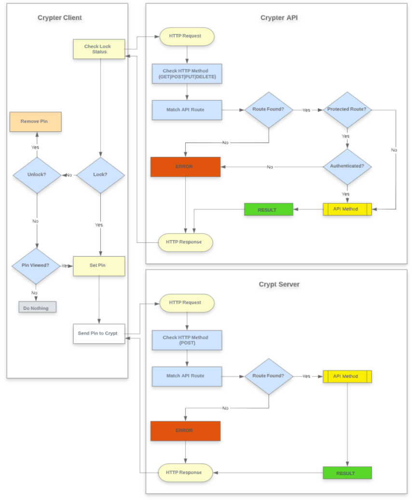

# Goal

Deploy Crypt and Crypter-API with Docker on AWS and communicate with the two services using crypter-client.

# Table of Contents
1. [Understand Crypt Service Components](#understand-crypt-service-components)
2. [Set up the EC2 instance](#set-up-the-ec2-instance)
3. [Install Docker on the EC2 instance](#install-docker-on-the-ec2-instance)
4. [Configure AWS RDS for data persistence](#configure-aws-rds-for-data-persistence)
5. [Configure an AWS Security Group](#fourth-examplehttpwwwfourthexamplecom)
6. [Deploy Crypt to AWS EC2 with Docker](#fourth-examplehttpwwwfourthexamplecom)
7. [Run the Django app behind an HTTPS Nginx](#fourth-examplehttpwwwfourthexamplecom)
8. [Deploying Crypter Docker Container](#deploying-crypter-docker-container)
9. [Troubleshooting](#fourth-examplehttpwwwfourthexamplecom)

In this POC lab guide, we'll deploy crypt to AWS EC2 with Docker. The app will run behind an HTTPS Nginx proxy that uses Let's Encrypt SSL certificates. We'll also use AWS RDS to serve our Postgres database. As an added bonus we also Setup Crypter, a containerized micro-service that can work in tandem with Crypt to provide an end to end, **client -> server**, secrets management solution. This guide is intended to aid in understanding the technolgies used in the Uber Client Platform Engineering Teams Crypt Service Deployment. As well as showcase potential improvements to the existing Architecture. For a detailed overview of our current Production deplyment, please refer to the *[Crypt Service Architecture](addlink)* teamDot Article.


### What is Crypt & Crypter?
Crypt is a system for centrally storing FileVault 2 and Luks recovery keys. It is made up of a client app, and a Django web app for storing the keys.

The official *[Crypt Docker Image](addlink)* contains the fully configured Crypt Django web app. A default admin user has been preconfigured, use admin/password to login.

Crypter is a GO client -> server **client -> server**, secrets management micro-service, that provides us with a binary that can be deployed to enable encryption, ship the keys to crypt and provide an api endpoint that can easily be integrated with other third party tools without the risk of exposing the secrets.

## Understand Crypt Service Components
#### Crypt-Client
The Crypt-Client is an authorization plugin that enforces FileVault 2 and LUKS, and then submits the encryption keys to the instance of Crypt-Server. Preferences can be set either in `/Library/Preferences/com.grahamgilbert.crypt.plist` or via MCX / Profiles. An example profile can be found [here](https://github.com/grahamgilbert/crypt/blob/master/Example%20Crypt%20Profile.mobileconfig).
  - Uses native authorization plugin so FileVault enforcement cannot be skipped.

  - Escrow is delayed until there is an active user, so FileVault can be enforced when the Mac is offline.

  - Administrators can specify a series of username that should not have to enable FileVault (IT admin, for example).

  - The Crypt Client is a standard .pkg we deploy with Chef. Whatever you're using to manage your client machines. You can configure your clients' Crypt preferences before deploying the .pkg.

  - When the user who's okay to enable encryption (one not in the SkipUsers array) logs in, a window will pop up that says This machine must be encrypted. It will reboot shortly after clicking continue.

  - Crypt will write a file to /var/root/crypt_output.plist with values for EnabledDate, EnabledUser, HardwareUUID, LVGUUID, LVUUID, PVUUID, RecoveryKey, and SerialNumber.

  - After that, probably nothing will happen for some time. Crypt runs a Launch Daemon that invokes /Library/Crypt/checkin every 900 seconds (15 minutes) 120 seconds (2 minutes). After around that time, you should see the client machine show up in the web interface the admin sees.

##### Client Settings
* ``ServerURL`` - The `ServerURL` preference sets your Crypt Server. Crypt will not enforce FileVault if this preference isn't set.

```bash
$ sudo defaults write /Library/Preferences/com.grahamgilbert.crypt ServerURL "https://crypt.example.com"
```

* ``SkipUsers`` - The `SkipUsers` preference allows you to define an array of users that will not be forced to enable FileVault.

```bash
$ sudo defaults write /Library/Preferences/com.grahamgilbert.crypt SkipUsers -array-add adminuser
```

* ``RemovePlist`` - By default, the plist with the FileVault Key will be removed once it has been escrowed. In a future version of Crypt, there will be the possibility of verifying the escrowed key with the client. In preparation for this feature, you can now choose to leave the key on disk.

```bash
$ sudo defaults write /Library/Preferences/com.grahamgilbert.crypt RemovePlist -bool FALSE
```

* ``RotateUsedKey`` - For macOS 10.14 and below, Crypt2 can rotate the recovery key, if the key is used to unlock the disk. There is a small caveat that this feature only works if the key is still present on the disk. This is set to `TRUE` by default.

```bash
$ sudo defaults write /Library/Preferences/com.grahamgilbert.crypt RotateUsedKey -bool FALSE
```

For macOS 10.15 and above, you may want to use the `ROTATE_VIEWED_SECRETS` key in [Crypt Server](https://github.com/grahamgilbert/Crypt-Server#settings) if you want the client to get instructions to rotate the key.

* ``ValidateKey`` - Crypt can validate the recovery key if it is stored on disk. If the key fails validation, the plist is removed so it can be regenerated on next login. This is set to `TRUE` by default.

```bash
$ sudo defaults write /Library/Preferences/com.grahamgilbert.crypt ValidateKey -bool FALSE
```

* ``OutputPath`` - As of version 3.0.0 you can now define a new location for where the recovery key is written to. Default for this is `'/var/root/crypt_output.plist'`.

```bash
$ sudo defaults write /Library/Preferences/com.grahamgilbert.crypt OutputPath "/path/to/different/location"
```

* ``KeyEscrowInterval`` - As of version 3.0.0 you can now define the time interval in Hours for how often Crypt tries to re-escrow the key, after the first successful escrow. Default for this is `1` hour.

```bash
$ sudo defaults write /Library/Preferences/com.grahamgilbert.crypt KeyEscrowInterval -int 2
```

* ``AdditionalCurlOpts`` - The `AdditionalCurlOpts` preference allows you to define an array of additional `curl` options to add to the `curl` command run during checkin to escrow the key to Crypt Server.

```bash
$ sudo defaults write /Library/Preferences/com.grahamgilbert.crypt AdditionalCurlOpts -array-add "--tlsv1.3"
```

* ``PostRunCommand`` - (Introduced in version 3.2.0) This is a command that is run after Crypt has detected an error condition with a stored key that cannot be resolved silently - either it has failed validation or the server has instructed the client to rotate the key. These cannot be resolved silently on APFS volumes, so the user will need to log in again. If you have a tool that can enforce a logout or a reboot, you can run it here. This preference can either be a string if your command has no spaces, or an array if there are spaces in the command.

* ``Uninstalling`` - The install package will modify the Authorization DB - you need to remove these entries before removing the Crypt Authorization Plugin. A script that will do this can be found at [Package/uninstall](https://github.com/grahamgilbert/crypt2/blob/master/Package/uninstall).

* ``Building from source`` - You will need to configure Xcode 9.3 (requires 10.13.2 or later) to sign the bundle before building. Instructions for this are out of the scope of this readme, and [are available on Apple's site](https://developer.apple.com/support/code-signing/).

- Install [The Luggage](https://github.com/unixorn/luggage)
- `cd Package`
- `make pkg`


#### Crypt-Server
The Crypt-Server in short consists of the Docker image containing the fully configured Crypt Django web app. This web app is then deployed to AWS EC2 with Docker.
  - Secrets are encrypted in the database
  - All access is audited - all reasons for retrieval and approval are logged along side the users performing the actions
  - Two step approval for retrieval of secrets is enabled by default
  - Approval permission can be given to all users (so just any two users need to approve the retrieval) or a specific group of users
All settings that would be entered into `settings.py` can also be passed into the Docker container as environment variables.

##### Server Settings
* ``FIELD_ENCRYPTION_KEY`` - The key to use when encrypting the secrets. This is required.

* ``SEND_EMAIL`` - Crypt Server can send email notifcations when secrets are requested and approved. Set ``SEND_EMAIL`` to True, and set ``HOST_NAME`` to your server's host and URL scheme (e.g. ``https://crypt.example.com``). For configuring your email settings, see the [Django documentation](https://docs.djangoproject.com/en/3.1/ref/settings/#std:setting-EMAIL_HOST).

* ``EMAIL_SENDER`` - The email address to send emaiil notifications from when secrets are requests and approved. Ensure this is verified if you are using SES. Does nothing unless ``SEND_EMAIIL`` is True.

* ``APPROVE_OWN`` - By default, users with approval permissons can approve their own key requests. By setting this to False in settings.py (or by using the `APPROVE_OWN` environment variable with Docker), users cannot approve their own requests.

* ``ALL_APPROVE`` - By default, users need to be explicitly given approval permissions to approve key retrieval requests. By setting this to True in `settings.py`, all users are given this permission when they log in.

* ``ROTATE_VIEWED_SECRETS`` - With a compatible client (such as Crypt 3.2.0 and greater), Crypt Server can instruct the client to rotate the secret and re-escrow it when the secret has been viewed. Enable by setting this to `True` or by using `ROTATE_VIEWED_SECRETS` and setting to `true`.

## Set up a new EC2 instance
- First, create an AWS account if you don't already have one.

- Next, navigate to the EC2 console and click Launch instance:
  - EC2 Home

- Use Ubuntu Server 18.04 LTS (HVM) for the server image (AMI):
  - Select AMI

- In the next step, stick with the t2.micro instance. Click on Next:
  - Configure Instance Details:
    - EC2 instance type
    - At the Configure Instance Details step, leave everything as it is to keep things simple.

- Now click Next a few times until you're at the Configure Security Group step.
- With Create a new security group selected, set the name and description to django-ec2 and add two rules:

  - HTTP -> Anywhere
  - HTTPS -> Anywhere

- These rules are needed to issue certificates and to access the app.
---
**NOTE**

Security group inbound rules are used to limit access to your instance from the internet. Unless you have some additional security requirements, you'll probably want to allow HTTP and HTTPS traffic from anywhere for instances hosting web apps. SSH must be allowed for you to connect to the instance for set up and deployment.

---


- Click Review and Launch. On the next screen, click Launch.

- You'll be prompted to select a key pair. You need it for SSH connection to your instance. Select Create a new key pair and name it aws-crypt. Then click Download key pair. After the key pair is downloaded, click on Launch Instances:
  - EC2 Add key pair

- It will take a few minutes for the instance to spin up.

## Install Docker on the EC2 instance
In this section, we'll install Docker on the instance, add an Elastic IP, and configure an IAM role.

#### Install Docker
- Navigate back to the EC2 console, select the newly created instance, and grab the public IP address:
  - EC2 Public IP

- Connect to your EC2 instance using the .pem key that we downloaded in the "AWS EC2" step.

```bash
$ ssh -i /path/to/your/aws-crypt.pem ubuntu@public-ip-or-domain-of-ec2-instance
```
- Your .pem was probably downloaded into path like ~/Downloads/aws-crypt.pem. If you're not sure where to store it, move it into the ~/.ssh directory.
- You may have to also change the permissions -- i.e., chmod 400 -i /path/to/your/aws-crypy.pem.

- Start by installing the latest version of Docker and version 1.29.2 of Docker Compose:

```bash
$ sudo apt update
$ sudo apt install apt-transport-https ca-certificates curl software-properties-common
$ curl -fsSL https://download.docker.com/linux/ubuntu/gpg | sudo apt-key add -
$ sudo add-apt-repository "deb [arch=amd64] https://download.docker.com/linux/ubuntu bionic stable"
$ sudo apt update
$ sudo apt install docker-ce
$ sudo usermod -aG docker ${USER}
$ sudo curl -L "https://github.com/docker/compose/releases/download/1.29.2/docker-compose-$(uname -s)-$(uname -m)" -o /usr/local/bin/docker-compose
$ sudo chmod +x /usr/local/bin/docker-compose

$ docker -v
Docker version 20.10.8, build 3967b7d

$ docker-compose -v
docker-compose version 1.29.2, build 5becea4c
```

#### Install AWS CLI
- First, install unzip:
```bash
$ sudo apt install unzip
```

- Download AWS CLI ZIP:
```bash
$ curl "https://awscli.amazonaws.com/awscli-exe-linux-x86_64.zip" -o "awscliv2.zip"
```

- Unzip its content:

```bash
$ unzip awscliv2.zip
```

- Install AWS CLI:
```bash
$ sudo ./aws/install
```
- Verify installation:

```bash
$ aws --version
```


#### Configure Elastic IP (Optional)
By default, instances receive new public IP address every time they start and re-start.

Elastic IP allows you to allocate static IPs for your EC2 instances, so the IP stays the same all the time and can be re-associated between instances. It's recommended to use one for your production setup.

- Navigate to Elastic IPs and click Allocate Elastic IP address:
  - Elastic IP

- Then, click Allocate:
  - Elastic IP Allocate

- Click on Associate this Elastic IP address:
  - Elastic IP Associate

- Select your instance and click Associate:
  - Elastic IP Select Instance

## Configure AWS RDS for data persistence

Now we can configure an RDS Postgres database.

While you can run your own Postgres database in a container, since databases are critical services, adding additional layers, such us Docker, adds unnecessary risk in production. To simplify tasks such as minor version updates, regular backups, and scaling, it's recommended to use a managed service. So, we'll use RDS.

Navigate to the RDS console. Click on Create database:

RDS Home

Select the latest version of Postgres with the Free tier template:

RDS Create database

Under Settings, set:

DB Instance identifier: djangoec2
Master username: webapp
Select Auto generate a password
Stick with default settings for:

DB instance size
Storage
Availability & durability
Skip down to the Connectivity section and set the following:

Virtual private cloud (VPC): Default
Subnet group: default
Publicly accessible: No
VPC security group: django-ec2
Database port: 5432
RDS Create database connectivity

Leave Database authentication as it is.

Open Additional configuration and change Initial database name to djangoec2:

RDS Create database initial DB name

Leave the other settings as they are.

Finally, click Create database.

Click on View credentials details to see the generated password for the webapp user:

RDS View credentials

Store this password somewhere safe. You'll need to provide it to the Django application here shortly.

It will take a few of minutes for the instance to spin up. Once up, click on the DB Identifier of the newly created database to see its details. Take note of the database endpoint; you'll need to set it in your Django app.

RDS DB details

### 6. Deploy Crypt to AWS EC2 with Docker

#### Prepare for first use
When starting from scratch, create a new empty file on the docker host to hold the sqlite3 secrets database
``` bash
touch /somewhere/else/on/the/host
```

#### Upgrading from Crypt Server 2

The encryption method has changed in Crypt Server. You should pass in both your old encryption keys (e.g. `-v /somewhere/on/the/host:/home/docker/crypt/keyset`) and the new one (see below) for the first run to migrate your keys. After the migration you no longer need your old encryption keys. Crypt 3 is a major update, you should ensure any custom settings you pass are still valid.

#### Basic usage
``` bash
docker run -d --name="Crypt" \
--restart="always" \
-v /somewhere/else/on/the/host:/home/docker/crypt/crypt.db \
-e FIELD_ENCRYPTION_KEY='yourencryptionkey' \
-p 8000:8000 \
macadmins/crypt-server
```

The secrets are encrypted, with the encryption key passed in as an environment variable. You should back this up as the keys are not recoverable without them.

#### Generating an encryption key

Run the following command to generate an encryption key (you should specify the string only):

```
docker run --rm -ti macadmins/crypt-server \
python3 -c "from cryptography.fernet import Fernet; print(Fernet.generate_key())"
```

#### Backing up the database with a data dump
``` bash
docker exec -it Crypt bash
cd /home/docker/crypt/
python manage.py dumpdata > db.json
exit
docker cp Crypt:/home/docker/crypt/db.json .
```
Optionally
``` bash
docker exec -it Crypt bash
rm /home/docker/crypt/db.json
exit
```

#### Using Postgres as an external database

Crypt, by default, uses a sqlite3 database for the django db backend.  Crypt also supports using Postgres as the django db backend.  If you would like to use an external Postgres server, you need to set the following environment variables:

```
docker run -d --name="Crypt" \
--restart="always" \
-p 8000:8000 \
-e DB_HOST='db.example.com' \
-e DB_PORT='5432' \
-e DB_NAME='postgres_dbname' \
-e DB_USER='postgres_user' \
-e DB_PASS='postgres_user_pass' \
-e FIELD_ENCRYPTION_KEY='yourencryptionkey' \
macadmins/crypt-server
```

#### Emails

If you would like Crypt to send emails when keys are requested and approved, you should set the following environment variables:

```
docker run -d --name="Crypt" \
--restart="always" \
-v /somewhere/on/the/host:/home/docker/crypt/keyset \
-v /somewhere/else/on/the/host:/home/docker/crypt/crypt.db \
-p 8000:8000 \
-e EMAIL_HOST='mail.yourdomain.com' \
-e EMAIL_PORT='25' \
-e EMAIL_USER='youruser' \
-e EMAIL_PASSWORD='yourpassword' \
-e HOST_NAME='https://crypt.myorg.com' \
-e FIELD_ENCRYPTION_KEY='yourencryptionkey' \
macadmins/crypt-server
```

If your SMTP server doesn't need a setting (username and password for example), you should omit it. The `HOST_NAME` setting should be the hostname of your server - this will be used to generate links in emails.

#### SSL

It is recommended to use either an Nginx proxy in front of the Crypt app for SSL termination (outside of the scope of this document, see [here](https://www.digitalocean.com/community/tutorials/how-to-secure-nginx-with-let-s-encrypt-on-ubuntu-18-04) and [here](https://www.linode.com/docs/web-servers/nginx/use-nginx-reverse-proxy/) for more information), or to use Caddy. Caddy will also handle setting up letsencrypt SSL certificates for you. An example Caddyfile is included in `docker/Caddyfile`. Using Crypt without SSL __will__ result in your secrets being compromised.

_Note Caddy is only free for personal use. For commercial deployments you should build from source yourself or use Nginx._

#### X-Frame-Options

The nginx config included with the docker container configures the X-Frame-Options as sameorigin. This protects against a potential attacker using iframes to do bad stuff with Crypt.

Depending on your environment you may need to also configure X-Frame-Options on any proxies in front of Crypt.

#### docker-compose

An example `docker-compose.yml` is included. For basic usuage, you should only need to edit the `FIELD_ENCRYPTION_KEY`.


###
#### Django Server migrations
Migrations are Django's way of propagating changes you make to your models (adding a field, deleting a model, etc.) into your database schema. They're designed to be mostly automatic, but you'll need to know when to make migrations, when to run them, and the common problems you might run into.


#### Postgres Sql
Show constraints in table
```sql
SELECT con.*
       FROM pg_catalog.pg_constraint con
            INNER JOIN pg_catalog.pg_class rel
                       ON rel.oid = con.conrelid
            INNER JOIN pg_catalog.pg_namespace nsp
                       ON nsp.oid = connamespace
       WHERE nsp.nspname = 'public'
             AND rel.relname = 'server_secret';
```

In server_computer how does a record relate to server_secret?
```sql
select
  (select r.relname from pg_class r where r.oid = c.conrelid) as table,
  (select array_agg(attname) from pg_attribute
   where attrelid = c.conrelid and ARRAY[attnum] <@ c.conkey) as col,
  (select r.relname from pg_class r where r.oid = c.confrelid) as ftable
from pg_constraint c
where c.confrelid = (select oid from pg_class where relname = 'server_computer');
```
Output
```bash
     table     |      col      |     ftable
---------------+---------------+-----------------
 server_secret | {computer_id} | server_computer
(1 row)
```

First delete computer_id object from server_secret
```bash
crypt=> DELETE FROM server_secret WHERE computer_id=18;
DELETE 1
```

Now delete server_computer.id
```bash
crypt=> SELECT * FROM server_secret;
crypt=> DELETE FROM server_computer WHERE server_computer.id=18;
DELETE 1
```

Show count of each record
```sql
crypt=> select id, secret, count(*)
FROM server_secret
group by id, secret;
```


## Deploying Crypter Docker Container



#### How to run

Pull down the Crypter Docker Image
```shell script
docker pull github.com/ten16thomasg:crypter-api
```

Clone the Crypter github repo
```shell script
git clone github.com/ten16thomasg/crypter-api
```

Change Directory into ./crypter-api
```shell script
cd ./crypter-api
```

Install Crypter project dependencies

```shell script
go run github.com/ten16thomasg/crypter-api
```
or
```shell script
go build -o ./bin/main
```

Build the image using the command in our root directory i.e. ./crypter-api
```shell script
docker-compose up
```

##### How to test
```shell script
go test -v server.go main.go handlers_test.go  -covermode=count  -coverprofile=./bin/coverage.out
```

##### Initial Structure
```
    .
    ├── bin
    │   ├── coverage.out
    │   └── main
    ├── errors
    │   └── errors.go
    ├── handlers
    │   └── handlers.go
    ├── objects
    │   ├── event.go
    │   └── requests.go
    ├── store
    │   ├── postgres.go
    │   └── store.go
    ├── test
    │   ├── main.go
    │   └── test.go
    ├── .gitignore
    ├── docker-compose.yml
    ├── Dockerfile
    ├── go.mod
    ├── main.go
    ├── README.md
    └── server.go
```

#### Rest api
**Object: Event**
```go
package objects

import (
	"time"
)

// EventStatus defines the status of the event
type EventStatus string

const (
	// Some default event status
	Original    EventStatus = "original"
)

type TimeSlot struct {
	StartTime time.Time `json:"start_time,omitempty"`
	EndTime   time.Time `json:"end_time,omitempty"`
}

// Event object for the API
type Event struct {
	// Identifier
	ID string `gorm:"primary_key" json:"id,omitempty"`

	// General details
	Name        string `json:"name,omitempty"`
	Platform string `json:"Platform,omitempty"`
	Source     string `json:"source,omitempty"`
	State     string `json:"state,omitempty"`
	SerialNumber string `json:"serial_number,omitempty"`

	// Event slot duration
	Slot *TimeSlot `gorm:"embedded" json:"slot,omitempty"`

	// Change status
	Status EventStatus `json:"status,omitempty"`

	// Meta information
	CreatedOn     time.Time `json:"created_on,omitempty"`
	UpdatedOn     time.Time `json:"updated_on,omitempty"`
}
```

#### Endpoints

**Get all events**
```go
package main

import (
  "fmt"
  "net/http"
  "io/ioutil"
)

func main() {

  url := "http://localhost:8080/api/v1/events"
  method := "GET"

  client := &http.Client {
  }
  req, err := http.NewRequest(method, url, nil)

  if err != nil {
    fmt.Println(err)
    return
  }
  res, err := client.Do(req)
  if err != nil {
    fmt.Println(err)
    return
  }
  defer res.Body.Close()

  body, err := ioutil.ReadAll(res.Body)
  if err != nil {
    fmt.Println(err)
    return
  }
  fmt.Println(string(body))
}
###
```

**Get Single event**
```go
package main

import (
  "fmt"
  "net/http"
  "io/ioutil"
)

func main() {

  url := "http://localhost:8080/api/v1/event?id=1650030060-0643970700-9740512683"
  method := "GET"

  client := &http.Client {
  }
  req, err := http.NewRequest(method, url, nil)

  if err != nil {
    fmt.Println(err)
    return
  }
  res, err := client.Do(req)
  if err != nil {
    fmt.Println(err)
    return
  }
  defer res.Body.Close()

  body, err := ioutil.ReadAll(res.Body)
  if err != nil {
    fmt.Println(err)
    return
  }
  fmt.Println(string(body))
}
###
```

**Create an event**
```go
package main

import (
  "fmt"
  "strings"
  "net/http"
  "io/ioutil"
)

func main() {

  url := "http://localhost:8080/api/v1/event"
  method := "POST"

  payload := strings.NewReader(`{
    "name": "Desktop-12345",
    "Platform": "Windows",
    "slot": {
        "start_time": "2020-12-11T09:00:00+05:30",
        "end_time": "2020-12-11T15:00:00+05:30"
    },
    "source": "Crypter Client",
    "state": "Lock",
    "serial_number": "698HG356I"
}`)

  client := &http.Client {
  }
  req, err := http.NewRequest(method, url, payload)

  if err != nil {
    fmt.Println(err)
    return
  }
  req.Header.Add("Content-Type", "application/json")

  res, err := client.Do(req)
  if err != nil {
    fmt.Println(err)
    return
  }
  defer res.Body.Close()

  body, err := ioutil.ReadAll(res.Body)
  if err != nil {
    fmt.Println(err)
    return
  }
  fmt.Println(string(body))
}
###
```

**List at max 40 events**
```go
package main

import (
  "fmt"
  "net/http"
  "io/ioutil"
)

func main() {

  url := "http://localhost:8080/api/v1/events?limit=40"
  method := "GET"

  client := &http.Client {
  }
  req, err := http.NewRequest(method, url, nil)

  if err != nil {
    fmt.Println(err)
    return
  }
  res, err := client.Do(req)
  if err != nil {
    fmt.Println(err)
    return
  }
  defer res.Body.Close()

  body, err := ioutil.ReadAll(res.Body)
  if err != nil {
    fmt.Println(err)
    return
  }
  fmt.Println(string(body))
}
###
```

**Update event details**
```go
package main

import (
  "fmt"
  "strings"
  "net/http"
  "io/ioutil"
)

func main() {

  url := "http://localhost:8080/api/v1/event"
  method := "PUT"

  payload := strings.NewReader(`{
    "name": "Desktop-12345",
    "Platform": "Windows",
    "source": "Crypter Client",
    "state": "Unlock",
    "serial_number": "698HG356I"
}`)

  client := &http.Client {
  }
  req, err := http.NewRequest(method, url, payload)

  if err != nil {
    fmt.Println(err)
    return
  }
  req.Header.Add("Content-Type", "application/json")

  res, err := client.Do(req)
  if err != nil {
    fmt.Println(err)
    return
  }
  defer res.Body.Close()

  body, err := ioutil.ReadAll(res.Body)
  if err != nil {
    fmt.Println(err)
    return
  }
  fmt.Println(string(body))
}
###
```

**Delete the event**
```go
package main

import (
  "fmt"
  "net/http"
  "io/ioutil"
)

func main() {

  url := "http://localhost:8080/api/v1/events?limit=1"
  method := "DELETE"

  client := &http.Client {
  }
  req, err := http.NewRequest(method, url, nil)

  if err != nil {
    fmt.Println(err)
    return
  }
  res, err := client.Do(req)
  if err != nil {
    fmt.Println(err)
    return
  }
  defer res.Body.Close()

  body, err := ioutil.ReadAll(res.Body)
  if err != nil {
    fmt.Println(err)
    return
  }
  fmt.Println(string(body))
}package main

import (
  "fmt"
  "net/http"
  "io/ioutil"
)

func main() {

  url := "http://localhost:8080/api/v1/events?limit=1"
  method := "DELETE"

  client := &http.Client {
  }
  req, err := http.NewRequest(method, url, nil)

  if err != nil {
    fmt.Println(err)
    return
  }
  res, err := client.Do(req)
  if err != nil {
    fmt.Println(err)
    return
  }
  defer res.Body.Close()

  body, err := ioutil.ReadAll(res.Body)
  if err != nil {
    fmt.Println(err)
    return
  }
  fmt.Println(string(body))
}
###
```
##### Run Crypter Docker Container on EC2


