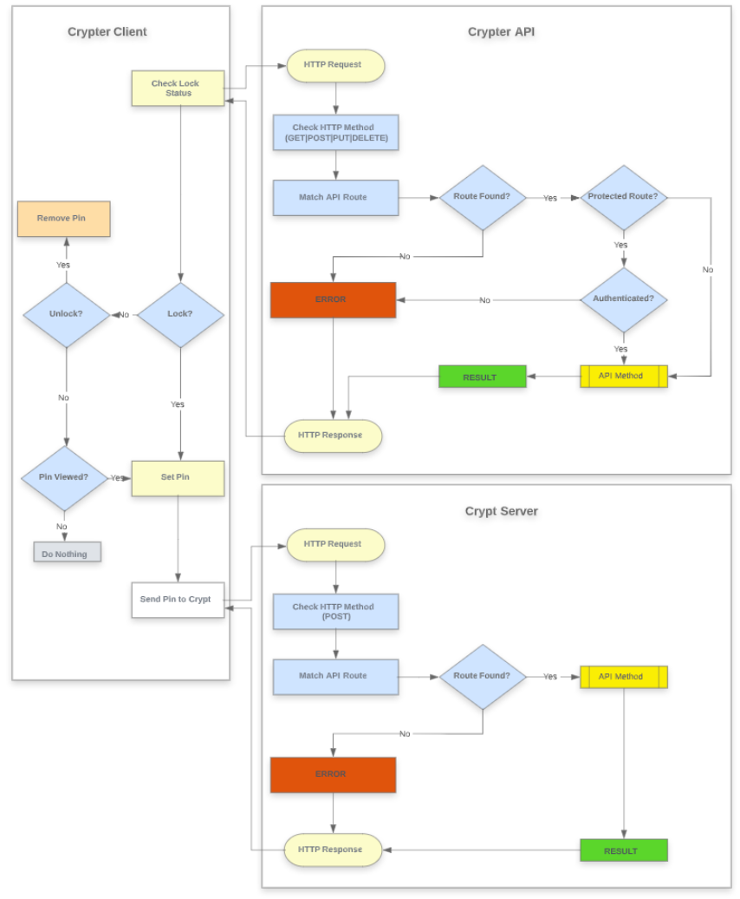

[](https://github.com/ten16thomasg/crypter/latest)

# Goal

The goal of this project is to create a deploy a POC crypt environment to AWS EC2 with Docker. The app will run behind an HTTPS Nginx proxy that uses Let's Encrypt SSL certificates. We'll also use AWS RDS to serve our Postgres database. As an added bonus we also Setup Crypter, a containerized micro-service that can work in tandem with Crypt to provide an end to end, client -> server, secrets management solution. This is intended to aid in understanding the technologies used to run Crypt Service Deployment in a production environment securely. As well as showcase potential improvements and extend the capabilities of the Default CRUD Crypt Django Application written by Graham https://github.com/grahamgilbert/Crypt-Server. 

Features:

1. **TODO:**

# Status

It works

1. This project is not api stable, however I believe it will be simple if you do use the current api to migrate to any future changes.

**TODO:**

- [x] add some code for easy back and forth json serialization of complex objects
- [X] more examples / tests
- [ ] example / helper classes around exception
- [x] a doc overview
- [x] plumb through callback handler for each specific logging type (verbose, debug, warning, ...)
- [x] support for default loggers, like glog or log (in separate package)

# Usage



#### How to run

Pull down the Crypter Docker Image
```shell script
docker pull github.com/ten16thomasg:crypter-api
```

Clone the Crypter github repo
```shell script
git clone github.com/ten16thomasg/crypter-api
```

Change Directory into ./crypter-api
```shell script
cd ./crypter-api
```

Install Crypter project dependencies

```shell script
go run github.com/ten16thomasg/crypter-api
```
or
```shell script
go build -o ./bin/main
```

Build the image using the command in our root directory i.e. ./crypter-api
```shell script
docker-compose up
```

##### How to test
```shell script
go test -v server.go main.go handlers_test.go  -covermode=count  -coverprofile=./bin/coverage.out
```

##### Initial Structure
```
    .
    ├── bin
    │   ├── coverage.out
    │   └── main
    ├── errors
    │   └── errors.go
    ├── handlers
    │   └── handlers.go
    ├── objects
    │   ├── event.go
    │   └── requests.go
    ├── store
    │   ├── postgres.go
    │   └── store.go
    ├── test
    │   ├── main.go
    │   └── test.go
    ├── .gitignore
    ├── docker-compose.yml
    ├── Dockerfile
    ├── go.mod
    ├── main.go
    ├── README.md
    └── server.go
```

#### Rest api
**Object: Event**
```go
package objects

import (
	"time"
)

// EventStatus defines the status of the event
type EventStatus string

const (
	// Some default event status
	Original    EventStatus = "original"
)

type TimeSlot struct {
	StartTime time.Time `json:"start_time,omitempty"`
	EndTime   time.Time `json:"end_time,omitempty"`
}

// Event object for the API
type Event struct {
	// Identifier
	ID string `gorm:"primary_key" json:"id,omitempty"`

	// General details
	Name        string `json:"name,omitempty"`
	Platform string `json:"Platform,omitempty"`
	Source     string `json:"source,omitempty"`
	State     string `json:"state,omitempty"`
	SerialNumber string `json:"serial_number,omitempty"`

	// Event slot duration
	Slot *TimeSlot `gorm:"embedded" json:"slot,omitempty"`

	// Change status
	Status EventStatus `json:"status,omitempty"`

	// Meta information
	CreatedOn     time.Time `json:"created_on,omitempty"`
	UpdatedOn     time.Time `json:"updated_on,omitempty"`
}
```

#### Endpoints

**Get all events**
```go
package main

import (
  "fmt"
  "net/http"
  "io/ioutil"
)

func main() {

  url := "http://localhost:8080/api/v1/events"
  method := "GET"

  client := &http.Client {
  }
  req, err := http.NewRequest(method, url, nil)

  if err != nil {
    fmt.Println(err)
    return
  }
  res, err := client.Do(req)
  if err != nil {
    fmt.Println(err)
    return
  }
  defer res.Body.Close()

  body, err := ioutil.ReadAll(res.Body)
  if err != nil {
    fmt.Println(err)
    return
  }
  fmt.Println(string(body))
}
###
```

**Get Single event**
```go
package main

import (
  "fmt"
  "net/http"
  "io/ioutil"
)

func main() {

  url := "http://localhost:8080/api/v1/event?id=1650030060-0643970700-9740512683"
  method := "GET"

  client := &http.Client {
  }
  req, err := http.NewRequest(method, url, nil)

  if err != nil {
    fmt.Println(err)
    return
  }
  res, err := client.Do(req)
  if err != nil {
    fmt.Println(err)
    return
  }
  defer res.Body.Close()

  body, err := ioutil.ReadAll(res.Body)
  if err != nil {
    fmt.Println(err)
    return
  }
  fmt.Println(string(body))
}
###
```

**Create an event**
```go
package main

import (
  "fmt"
  "strings"
  "net/http"
  "io/ioutil"
)

func main() {

  url := "http://localhost:8080/api/v1/event"
  method := "POST"

  payload := strings.NewReader(`{
    "name": "Desktop-12345",
    "Platform": "Windows",
    "slot": {
        "start_time": "2020-12-11T09:00:00+05:30",
        "end_time": "2020-12-11T15:00:00+05:30"
    },
    "source": "Crypter Client",
    "state": "Lock",
    "serial_number": "698HG356I"
}`)

  client := &http.Client {
  }
  req, err := http.NewRequest(method, url, payload)

  if err != nil {
    fmt.Println(err)
    return
  }
  req.Header.Add("Content-Type", "application/json")

  res, err := client.Do(req)
  if err != nil {
    fmt.Println(err)
    return
  }
  defer res.Body.Close()

  body, err := ioutil.ReadAll(res.Body)
  if err != nil {
    fmt.Println(err)
    return
  }
  fmt.Println(string(body))
}
###
```

**List at max 40 events**
```go
package main

import (
  "fmt"
  "net/http"
  "io/ioutil"
)

func main() {

  url := "http://localhost:8080/api/v1/events?limit=40"
  method := "GET"

  client := &http.Client {
  }
  req, err := http.NewRequest(method, url, nil)

  if err != nil {
    fmt.Println(err)
    return
  }
  res, err := client.Do(req)
  if err != nil {
    fmt.Println(err)
    return
  }
  defer res.Body.Close()

  body, err := ioutil.ReadAll(res.Body)
  if err != nil {
    fmt.Println(err)
    return
  }
  fmt.Println(string(body))
}
###
```

**Update event details**
```go
package main

import (
  "fmt"
  "strings"
  "net/http"
  "io/ioutil"
)

func main() {

  url := "http://localhost:8080/api/v1/event"
  method := "PUT"

  payload := strings.NewReader(`{
    "name": "Desktop-12345",
    "Platform": "Windows",
    "source": "Crypter Client",
    "state": "Unlock",
    "serial_number": "698HG356I"
}`)

  client := &http.Client {
  }
  req, err := http.NewRequest(method, url, payload)

  if err != nil {
    fmt.Println(err)
    return
  }
  req.Header.Add("Content-Type", "application/json")

  res, err := client.Do(req)
  if err != nil {
    fmt.Println(err)
    return
  }
  defer res.Body.Close()

  body, err := ioutil.ReadAll(res.Body)
  if err != nil {
    fmt.Println(err)
    return
  }
  fmt.Println(string(body))
}
###
```

**Delete the event**
```go
package main

import (
  "fmt"
  "net/http"
  "io/ioutil"
)

func main() {

  url := "http://localhost:8080/api/v1/events?limit=1"
  method := "DELETE"

  client := &http.Client {
  }
  req, err := http.NewRequest(method, url, nil)

  if err != nil {
    fmt.Println(err)
    return
  }
  res, err := client.Do(req)
  if err != nil {
    fmt.Println(err)
    return
  }
  defer res.Body.Close()

  body, err := ioutil.ReadAll(res.Body)
  if err != nil {
    fmt.Println(err)
    return
  }
  fmt.Println(string(body))
}package main

import (
  "fmt"
  "net/http"
  "io/ioutil"
)

func main() {

  url := "http://localhost:8080/api/v1/events?limit=1"
  method := "DELETE"

  client := &http.Client {
  }
  req, err := http.NewRequest(method, url, nil)

  if err != nil {
    fmt.Println(err)
    return
  }
  res, err := client.Do(req)
  if err != nil {
    fmt.Println(err)
    return
  }
  defer res.Body.Close()

  body, err := ioutil.ReadAll(res.Body)
  if err != nil {
    fmt.Println(err)
    return
  }
  fmt.Println(string(body))
}
###
```

## Dependencies

github.com/iamacarpet/go-win64api
github.com/spf13/viper
github.com/gorilla/mux
github.com/ten16thomasg/crypter-api/handlers
github.com/ten16thomasg/crypter-api/store

### Build Binaries

1. Simply fetch the dependencies, `go get -d .` and then make sure to build, `go build`
1. Copy the precompiled psh_host.dll into your location so it can be found when running the app
    1. cmd - `copy %GOPATH%\src\github.com\KnicKnic\go-powershell\bin\psh_host.dll .`
    1. powershell - `copy "$($env:GOPATH)\src\github.com\KnicKnic\go-powershell\bin\psh_host.dll" .`
1. I ended up checking in the psh_host.dll and host.h (to make things easy)
    1. I could not find a better way to go about this and still have things be easy.


# Docs


