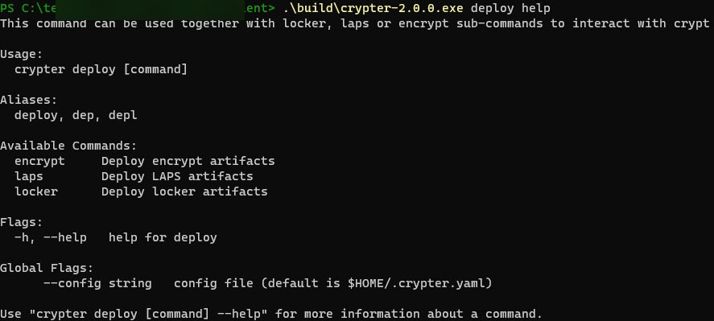
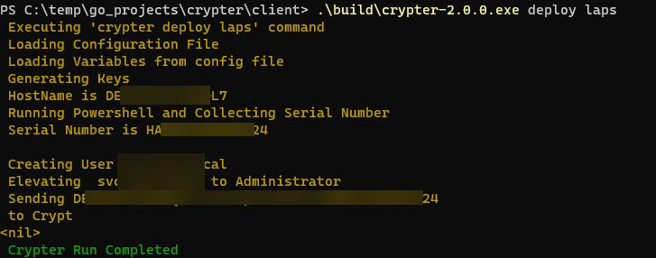

[](https://github.com/ten16thomasg/crypter/latest)

# Goal

<!-- TABLE OF CONTENTS -->
<details>
  <summary>Table of Contents</summary>
  <ol>
    <li>
      <a href="#goal">Goal</a>
      <ul>
        <li><a href="#features">Features</a></li>
      </ul>
    </li>
    <li>
      <a href="#status">Getting Started</a>
      <ul>
        <li><a href="#roadmap">Roadmap</a></li>
        <li><a href="#example-usage">Example Usage</a></li>
      </ul>
    </li>
    <li><a href="#dependencies">Dependencies</a></li>
    <li><a href="#acknowledgments">Acknowledgments</a></li>
  </ol>
</details>

The goal of this project is to showcase Crypter-API and Crypter-Clients, a containerized GO micro-service with portable GO binaries that work in tandem with Crypt to provide an end to end, client -> server, secrets management solution. I am running the server components of Crypt and Crypter-API on AWS EC2 with Docker, behind an HTTPS Nginx proxy. I also use AWS RDS to serve the Postgres database. Then As an added bonus I extend the capabilities of the Default CRUD Crypt Django Application written by Graham https://github.com/grahamgilbert/Crypt-Server by providing a front-end API to manage what data is sent to crypt with the crypter-client.

## Features
**Crypter-API**
  - Dockerized GO API Endpoint serving as a trigger for Crypter Clients. Host in cloud of choice and simply docker-compose up to build.
    - Get Events from Crypter-API
    - Post Events to Crypter-API
    - Delete Events from Crypter-API

**Crypter-Client**
- LAPS 2 Crypt. Simply update config file with desired encryption strength. Deploy the binary and let crypter do the rest. 
  - Creates a local admin account. 
  - Rotates the credentials 
  - Sends key to Crypt Server

- Crypter Locker. Binary Subscribes to the crypter-api and locks or unlocks an endpoint based on status returned. 
  - Rotate local group membership
  - Rotate local admin account credentials
  - Clear cached logons
  - Restart Device 

# Getting Started

It works

1. This project is not api stable, however I believe it will be simple if you do use the current api to migrate to any future changes.

**Roadmap**

- [ ] support for default loggers, like glog or log (in separate package)
- [ ] add built-in cron scheduler capability (Linux/Macos)
- [ ] add last rotation time stamp to registry
- [ ] more examples / tests
- [ ] add MacOS and Linux Support
- [ ] example / helper classes around exception
- [X] a doc overview
- [X] plumb through callback handler for each specific logging type (verbose, debug, warning, ...)

# Example Usage


https://user-images.githubusercontent.com/39165147/166816876-c43bf52a-9b70-4c52-ae51-8cff461c1c7c.mp4


## How to run Crypter-API

Pull down the Crypter Docker Image
```shell script
docker pull github.com/ten16thomasg:crypter-api
```

Clone the Crypter github repo
```shell script
git clone github.com/ten16thomasg/crypter-api
```

Change Directory into ./crypter-api
```shell script
cd ./crypter-api
```

Install Crypter project dependencies

```shell script
go run github.com/ten16thomasg/crypter-api
```
or
```shell script
go build -o ./bin/main
```

Build the image using the command in our root directory i.e. ./crypter-api
```shell script
docker-compose up
```

### How to test
```shell script
go test -v server.go main.go handlers_test.go  -covermode=count  -coverprofile=./bin/coverage.out
```

### Initial Structure
```
    .
    ├── bin
    │   ├── coverage.out
    │   └── main
    ├── errors
    │   └── errors.go
    ├── handlers
    │   └── handlers.go
    ├── objects
    │   ├── event.go
    │   └── requests.go
    ├── store
    │   ├── postgres.go
    │   └── store.go
    ├── test
    │   ├── main.go
    │   └── test.go
    ├── .gitignore
    ├── docker-compose.yml
    ├── Dockerfile
    ├── go.mod
    ├── main.go
    ├── README.md
    └── server.go
```

#### Rest api
**Object: Event**
```go
package objects

import (
	"time"
)

// EventStatus defines the status of the event
type EventStatus string

const (
	// Some default event status
	Original    EventStatus = "original"
)

type TimeSlot struct {
	StartTime time.Time `json:"start_time,omitempty"`
	EndTime   time.Time `json:"end_time,omitempty"`
}

// Event object for the API
type Event struct {
	// Identifier
	ID string `gorm:"primary_key" json:"id,omitempty"`

	// General details
	Name        string `json:"name,omitempty"`
	Platform string `json:"Platform,omitempty"`
	Source     string `json:"source,omitempty"`
	State     string `json:"state,omitempty"`
	SerialNumber string `json:"serial_number,omitempty"`

	// Event slot duration
	Slot *TimeSlot `gorm:"embedded" json:"slot,omitempty"`

	// Change status
	Status EventStatus `json:"status,omitempty"`

	// Meta information
	CreatedOn     time.Time `json:"created_on,omitempty"`
	UpdatedOn     time.Time `json:"updated_on,omitempty"`
}
```

#### Endpoints

**Get all events**
```go
package main

import (
  "fmt"
  "net/http"
  "io/ioutil"
)

func main() {

  url := "http://localhost:8080/api/v1/events"
  method := "GET"

  client := &http.Client {
  }
  req, err := http.NewRequest(method, url, nil)

  if err != nil {
    fmt.Println(err)
    return
  }
  res, err := client.Do(req)
  if err != nil {
    fmt.Println(err)
    return
  }
  defer res.Body.Close()

  body, err := ioutil.ReadAll(res.Body)
  if err != nil {
    fmt.Println(err)
    return
  }
  fmt.Println(string(body))
}
###
```

**Get Single event**
```go
package main

import (
  "fmt"
  "net/http"
  "io/ioutil"
)

func main() {

  url := "http://localhost:8080/api/v1/event?id=1650030060-0643970700-9740512683"
  method := "GET"

  client := &http.Client {
  }
  req, err := http.NewRequest(method, url, nil)

  if err != nil {
    fmt.Println(err)
    return
  }
  res, err := client.Do(req)
  if err != nil {
    fmt.Println(err)
    return
  }
  defer res.Body.Close()

  body, err := ioutil.ReadAll(res.Body)
  if err != nil {
    fmt.Println(err)
    return
  }
  fmt.Println(string(body))
}
###
```

**Create an event**
```go
package main

import (
  "fmt"
  "strings"
  "net/http"
  "io/ioutil"
)

func main() {

  url := "http://localhost:8080/api/v1/event"
  method := "POST"

  payload := strings.NewReader(`{
    "name": "Desktop-12345",
    "Platform": "Windows",
    "slot": {
        "start_time": "2020-12-11T09:00:00+05:30",
        "end_time": "2020-12-11T15:00:00+05:30"
    },
    "source": "Crypter Client",
    "state": "Lock",
    "serial_number": "698HG356I"
}`)

  client := &http.Client {
  }
  req, err := http.NewRequest(method, url, payload)

  if err != nil {
    fmt.Println(err)
    return
  }
  req.Header.Add("Content-Type", "application/json")

  res, err := client.Do(req)
  if err != nil {
    fmt.Println(err)
    return
  }
  defer res.Body.Close()

  body, err := ioutil.ReadAll(res.Body)
  if err != nil {
    fmt.Println(err)
    return
  }
  fmt.Println(string(body))
}
###
```

**List at max 40 events**
```go
package main

import (
  "fmt"
  "net/http"
  "io/ioutil"
)

func main() {

  url := "http://localhost:8080/api/v1/events?limit=40"
  method := "GET"

  client := &http.Client {
  }
  req, err := http.NewRequest(method, url, nil)

  if err != nil {
    fmt.Println(err)
    return
  }
  res, err := client.Do(req)
  if err != nil {
    fmt.Println(err)
    return
  }
  defer res.Body.Close()

  body, err := ioutil.ReadAll(res.Body)
  if err != nil {
    fmt.Println(err)
    return
  }
  fmt.Println(string(body))
}
###
```

**Update event details**
```go
package main

import (
  "fmt"
  "strings"
  "net/http"
  "io/ioutil"
)

func main() {

  url := "http://localhost:8080/api/v1/event"
  method := "PUT"

  payload := strings.NewReader(`{
    "name": "Desktop-12345",
    "Platform": "Windows",
    "source": "Crypter Client",
    "state": "Unlock",
    "serial_number": "698HG356I"
}`)

  client := &http.Client {
  }
  req, err := http.NewRequest(method, url, payload)

  if err != nil {
    fmt.Println(err)
    return
  }
  req.Header.Add("Content-Type", "application/json")

  res, err := client.Do(req)
  if err != nil {
    fmt.Println(err)
    return
  }
  defer res.Body.Close()

  body, err := ioutil.ReadAll(res.Body)
  if err != nil {
    fmt.Println(err)
    return
  }
  fmt.Println(string(body))
}
###
```

**Delete the event**
```go
package main

import (
  "fmt"
  "net/http"
  "io/ioutil"
)

func main() {

  url := "http://localhost:8080/api/v1/events?limit=1"
  method := "DELETE"

  client := &http.Client {
  }
  req, err := http.NewRequest(method, url, nil)

  if err != nil {
    fmt.Println(err)
    return
  }
  res, err := client.Do(req)
  if err != nil {
    fmt.Println(err)
    return
  }
  defer res.Body.Close()

  body, err := ioutil.ReadAll(res.Body)
  if err != nil {
    fmt.Println(err)
    return
  }
  fmt.Println(string(body))
}package main

import (
  "fmt"
  "net/http"
  "io/ioutil"
)

func main() {

  url := "http://localhost:8080/api/v1/events?limit=1"
  method := "DELETE"

  client := &http.Client {
  }
  req, err := http.NewRequest(method, url, nil)

  if err != nil {
    fmt.Println(err)
    return
  }
  res, err := client.Do(req)
  if err != nil {
    fmt.Println(err)
    return
  }
  defer res.Body.Close()

  body, err := ioutil.ReadAll(res.Body)
  if err != nil {
    fmt.Println(err)
    return
  }
  fmt.Println(string(body))
}
###
```
## How to run Crypter-Clients
```bash
$ go env
...
GOARCH="amd64"
GOHOSTARCH="amd64"
GOHOSTOS="linux"
GOOS="linux"
...
```
#### Compile for Windows
Here’s the command you need to run to compile your Go project for a 64-bit Windows machine:

In this scenario, GOOS is windows, and GOARCH is amd64 indicating a 64-bit architecture. If you need to support a 32-bit architecture, all you need to do is change GOARCH to 386.
```bash
$ GOOS=windows GOARCH=386 go build -o build/crypter-2.0.0-windows.exe
```
#### Compile for macOS
The GOARCH values for Windows are also valid for macOS, but in this case the required GOOS value is darwin:
**64-bit**
```bash
$ GOOS=darwin GOARCH=amd64 go build -o build/crypter-2.0.0-x64-darwin
```
**32-bit**
```bash
$ GOOS=darwin GOARCH=386 go build -o build/crypter-2.0.0-386-darwin
```
#### Compile for Linux
To build your Go program for Linux, use linux as the value of GOOS and the appropriate GOARCH value for your target CPU architecture:
**64-bit**
```bash
$ GOOS=linux GOARCH=amd64 go build -o build/crypter-2.0.0-x64-linux
```
**32-bit**
```
$ GOOS=linux GOARCH=386 go build -o build/crypter-2.0.0-386-linux
```
**Run crypter cli**






#### Get Crypter LAPS Status via CLI
Running crypter status returns Crypter last RotateTime and CrypterEnabled state in Json Format. 
Crypter collects this data from the registry. 

```powershell
PS C:\temp\go_projects\crypter\client> .\build\crypter-3.0.0.exe status laps
{
 "RotateTime": "05-17-2022 17:14:30",
 "CrypterEnabled": true
}
PS C:\temp\go_projects\crypter\client> .\build\crypter-3.0.0.exe status laps | ConvertTo-Json
[
    "{",
    " \"RotateTime\": \"05-17-2022 17:14:30\",",
    " \"CrypterEnabled\": true",
    "}"
]
PS C:\temp\go_projects\crypter\client> .\build\crypter-3.0.0.exe status laps | ConvertFrom-Json

RotateTime          CrypterEnabled
----------          --------------
05-17-2022 17:14:30           True

```


# Dependencies

**Install Dependencies**
```bash
go get `
  github.com/iamacarpet/go-win64api
  github.com/spf13/viper
  github.com/gorilla/mux
  github.com/ten16thomasg/crypter-api/handlers
  github.com/ten16thomasg/crypter-api/store
```

**Remove Unused Dependencies**
```bash
go mod tidy
```

<!-- ACKNOWLEDGMENTS -->
## Acknowledgments

Use this space to list resources you find helpful and would like to give credit to. I've included a few of my favorites to kick things off!

* [System Info and User Management Library](https://github.com/iamacarpet/go-win64api)
* [Config Manaegment JSON, TOML, YAML, HCL, envfile](https://github.com/spf13/viper)
* [HTTP router and URL matcher](https://github.com/gorilla/mux)
<p align="right">(<a href="#top">back to top</a>)</p>


